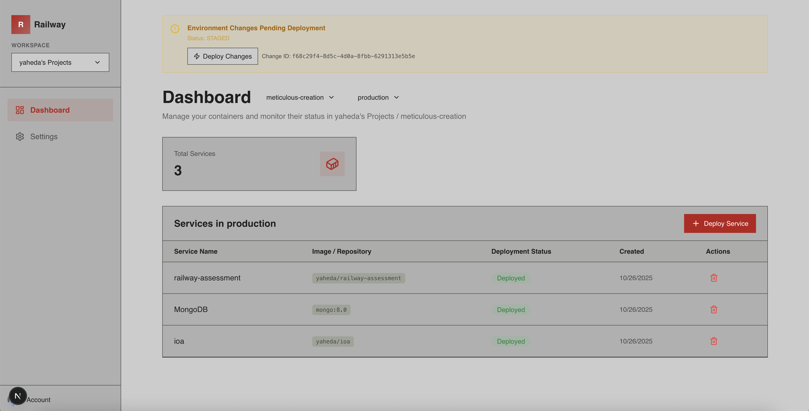

# Railway Assessment

A modern full-stack web application that provides an intuitive interface for managing containers through Railway.com. Users can spin up and spin down containers, manage multiple environments and projects, and deploy services with a guided wizard interface.

https://railway-assessment-production.up.railway.app/




## Project Overview

Railway Assessment is a Next.js 15 application built as a container management service for Railway.com. It enables users to:

- **Authenticate securely** using Clerk authentication
- **Manage workspaces, projects, and environments** with hierarchical organization
- **Deploy services** using a multi-step wizard supporting GitHub repositories and templates
- **Control container lifecycle** - spin containers up and down with a single click
- **Track deployment changes** with staged changes and deployment confirmation
- **Delete services** when no longer needed
- **Monitor service status** with visual indicators for availability and activity

## Key Features

- **User Authentication**: Secure sign-in and sign-up via Clerk
- **Workspace Management**: Organize projects within workspaces
- **Environment Selection**: Choose between different deployment environments (development, staging, production, etc.)
- **Deploy Wizard**: Multi-step deployment process with:
  - GitHub repository selection
  - Template selection for quick-start configurations
  - Service type configuration
  - Deployment confirmation and status tracking
- **Service Management**: Create, delete, and manage container services
- **Staged Changes**: Track pending deployments before confirming
- **Responsive Design**: Works seamlessly on desktop and mobile devices

## Tech Stack

- **Framework**: Next.js 15.5.6 with Turbopack for faster builds and development
- **UI Library**: React 19.1.0 with Server Components (RSC)
- **Component Library**: shadcn/ui (New York style) with Radix UI primitives
- **Styling**: Tailwind CSS v4 with custom OKLch color variables and animations
- **Type Safety**: TypeScript 5 with strict mode enabled
- **Authentication**: Clerk for secure user authentication
- **Database**: Prisma ORM with PostgreSQL
- **Icons**: Lucide React
- **Linting**: ESLint 9 with Next.js and TypeScript configurations

## Project Structure

```
src/
├── app/
│   ├── page.tsx                          # Home landing page
│   ├── layout.tsx                        # Root layout
│   ├── globals.css                       # Global Tailwind CSS configuration
│   ├── sign-in/[[...index]]/page.tsx     # Sign-in page (Clerk)
│   ├── sign-up/[[...index]]/page.tsx     # Sign-up page (Clerk)
│   ├── dashboard/
│   │   ├── page.tsx                      # Dashboard main page
│   │   ├── layout.tsx                    # Dashboard layout with sidebar
│   │   ├── settings/page.tsx             # Settings page
│   │   └── components/
│   │       ├── DashboardContent.tsx      # Main dashboard content component
│   │       ├── Sidebar.tsx               # Navigation sidebar
│   │       ├── ProjectSelector.tsx       # Project selection dropdown
│   │       ├── EnvironmentSelector.tsx   # Environment selection
│   │       ├── DeployServiceWizard.tsx   # Main wizard component
│   │       ├── StagedChangesAlert.tsx    # Staged changes notification
│   │       └── DeployWizardSteps/
│   │           ├── ServiceTypeSelector.tsx
│   │           ├── TemplateSelector.tsx
│   │           ├── TemplateCard.tsx
│   │           ├── GitHubRepoSelector.tsx
│   │           ├── GitHubRepoCard.tsx
│   │           ├── ConfirmationStep.tsx
│   │           ├── DeploymentSuccess.tsx
│   │           └── DeployWizardFooter.tsx
│   └── api/
│       ├── templates/route.ts            # Template retrieval
│       ├── github-repos/route.ts         # GitHub repositories
│       ├── deploy/route.ts               # Deploy service
│       ├── workspaces/route.ts           # Workspace management
│       ├── services/
│       │   ├── create/route.ts           # Create service
│       │   └── delete/route.ts           # Delete service
│       ├── environment-staged-changes/route.ts
│       ├── environment-patch-commit/route.ts
│       ├── service-instance-deploy/route.ts
│       └── workflow-status/route.ts
├── components/
│   ├── Navbar.tsx                        # Navigation bar
│   ├── Hero.tsx                          # Hero landing section
│   ├── FloatingOrbitals.tsx              # Animated background component
│   └── ui/                               # shadcn/ui components
│       ├── button.tsx
│       ├── dialog.tsx
│       ├── dropdown-menu.tsx
│       └── alert-dialog.tsx
├── context/
│   └── WorkspaceContext.tsx              # Global workspace state
└── lib/
    └── utils.ts                          # Utility functions (class merging)
```

## Main Screens

### 1. **Landing Page** (`/`)
- Eye-catching hero section with animated orbital background
- Clear value proposition: "Spin up and Spin down a container for railway.com"
- Call-to-action button directing users to the dashboard
- Navigation bar with sign-in/sign-up options

### 2. **Authentication Pages**
- **Sign In** (`/sign-in`) - Secure login via Clerk
- **Sign Up** (`/sign-up`) - User registration via Clerk

### 3. **Dashboard** (`/dashboard`)
- **Sidebar Navigation** - Quick access to different sections
- **Project Selector** - Choose which project to manage
- **Environment Selector** - Select deployment environment
- **Service Grid** - Display deployed services with:
  - Service name and status
  - Power button to start/stop containers
  - Delete button for service removal
  - Status indicators (running, stopped, etc.)
- **Deploy Button** - Floating action button to deploy new services

### 4. **Deploy Wizard** (Modal/Multi-Step)
The wizard guides users through deploying a new service:
- **Step 1**: Select service type (template-based or custom)
- **Step 2**: Choose template (if template-based) or GitHub repository (if custom)
- **Step 3**: Configure service settings
- **Step 4**: Review and confirm deployment
- **Final**: Display deployment success with service details

### 5. **Settings** (`/dashboard/settings`)
- User and workspace configuration
- Preferences and account settings

## Getting Started

### Prerequisites
- Node.js 18+ and npm/yarn
- PostgreSQL database
- Clerk account for authentication
- GitHub OAuth app (for repository selection)

### Installation

1. Clone the repository:
```bash
git clone <repository-url>
cd railway-assessment
```

2. Install dependencies:
```bash
npm install
```

3. Set up environment variables:
Create a `.env.local` file with:
```
NEXT_PUBLIC_CLERK_PUBLISHABLE_KEY=<your_clerk_publishable_key>
CLERK_SECRET_KEY=<your_clerk_secret_key>
DATABASE_URL=<your_postgresql_url>
# Add other required environment variables
```

4. Initialize the database:
```bash
npm run prisma:generate
npm run prisma:migrate
```

### Development

Start the development server:
```bash
npm run dev
```

The application will be available at `http://localhost:3000`

### Build for Production

Create an optimized production build:
```bash
npm run build
npm start
```

### Other Commands

| Command | Purpose |
|---------|---------|
| `npm run lint` | Run ESLint to check code quality |
| `npm run prisma:studio` | Open Prisma Studio for database management |

## Styling Architecture

The project uses Tailwind CSS v4 with a comprehensive CSS variables system:

- **Color System**: OKLch color space for accessible, modern colors
- **Light/Dark Theming**: Dual theme support with CSS custom properties
- **CSS Variables**: All design tokens (colors, shadows, fonts, radius) are CSS variables
- **Animations**: tw-animate-css library provides pre-built animations

Key CSS variables:
- **Colors**: background, foreground, card, primary, secondary, accent, destructive, border, input, ring
- **Typography**: --font-sans (Geist), --font-mono, --font-serif
- **Spacing & Radius**: Custom spacing unit and radius system
- **Shadows**: Shadow system with multiple variants

## Code Quality

- **Type Safety**: TypeScript 5 with strict mode enabled
- **Linting**: ESLint 9 with Next.js and TypeScript configurations
- **Component Patterns**: Composable components with CVA (class-variance-authority) for variants
- **Path Aliases**: `@/*` points to `./src/` for clean imports

## Important Notes

- The project uses Next.js v15 with Turbopack enabled by default for faster development
- Tailwind CSS v4 uses the new `@import "tailwindcss"` syntax
- Component colors automatically adapt to light/dark theme via CSS variables
- All fonts are optimized via the Next.js font system
- Clerk handles all authentication and user management
- Prisma ORM manages all database operations
